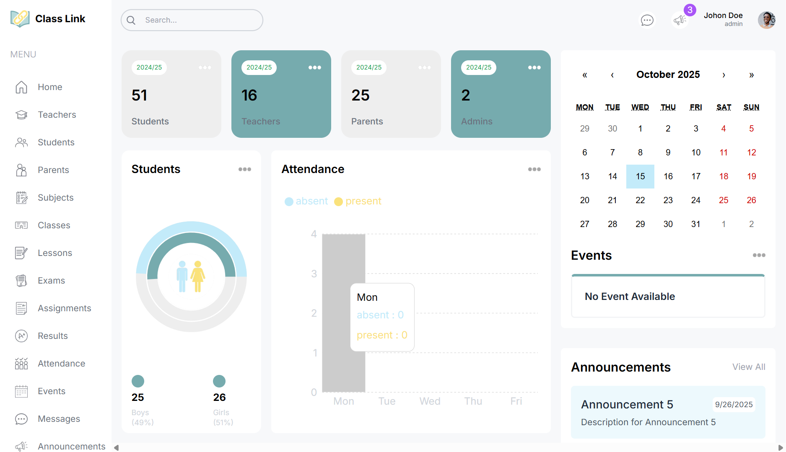

# 🎓 Class Link – Smart School Management Platform

**Class Link** is a modern school management platform that connects **teachers**, **students**, and **parents** in a single digital space.  
It simplifies how schools manage classes, exams, and student performance through a secure and user-friendly interface.

---

<p>
  
</p>

## 🚀 Tech Stack

| Layer | Technology |
|-------|-------------|
| **Frontend** | [Next.js](https://nextjs.org/) |
| **Authentication** | [Clerk](https://clerk.com/) |
| **Database ORM** | [Prisma](https://www.prisma.io/) |
| **Docker** | [Docker](https://www.docker.com/) |
| **Database** | PostgreSQL |
| **Styling** | Tailwind CSS |
| **Hosting** | Vercel / Render |

---

## 🧩 Features

### 👨‍🏫 Teachers
- Create, manage, and delete classes  
- Schedule and publish exams  
- Grade students and track their performance  
- Communicate with parents and students  

### 👩‍🎓 Students
- Join assigned classes  
- Take exams and view scores  
- Track progress and feedback from teachers  

### 👨‍👩‍👧 Parents
- View their child’s academic performance  
- Communicate directly with teachers  
- Get real-time updates about school activities  

### 🔐 Authentication & Roles
- Role-based access (Teacher, Student, Parent) via **Clerk**  
- Secure sign-up, login, and session handling  


---

## ⚙️ Installation & Setup

### 1️⃣ Clone the repository
```bash
git clone https://github.com/your-username/class-link.git
cd class-link
```

### 2️⃣ Install dependencies
```bash
npm install
```

### 3️⃣ Configure environment variables
Create a `.env` file in the project root:

```
DATABASE_URL="your_postgresql_database_url"
NEXT_PUBLIC_CLERK_PUBLISHABLE_KEY="your_clerk_publishable_key"
CLERK_SECRET_KEY="your_clerk_secret_key"
```

### 4️⃣ Run Prisma migrations
```bash
npx prisma migrate dev
```

### 5️⃣ Start the development server
```bash
npm run dev
```
App runs at **http://localhost:3000**

---

## 🔗 Deployment

- **Frontend** → Deploy easily on [Vercel](https://vercel.com/)  
- **Database** → Use [Neon](https://neon.tech/) or [Supabase](https://supabase.com/)  
- **Environment Variables** → Set them in your hosting dashboard  

---

## 🧠 Developer Notes

- Authentication and role management handled by **Clerk**  
- Database schema and relations powered by **Prisma**  
- Idea is to use Docker for running your DB locally
- Fully type-safe backend using **Next.js App Router + Server Actions**  
- Designed for scalability and easy feature extensions  

---

## 💡 Future Enhancements

- Real-time notifications for parents and students  
- AI-based performance analytics for teachers  
- Homework submission and grading module  
- Integration with Google Classroom and Calendar  

---

## 👨‍💻 Author
**Class Link** was developed by [UKOBIZABA Aimable](https://ukobizaba-aimable.vercel.app/)
Focused on building smart, educational platforms that empower teachers and students alike.

---

## 📜 License
This project is open-source and available under the **MIT License**.